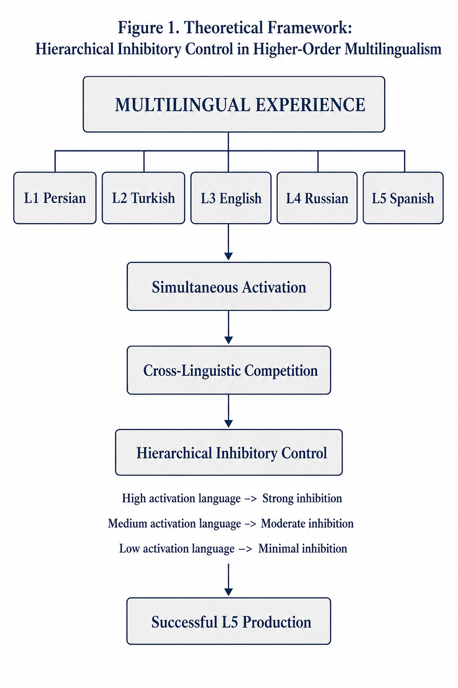
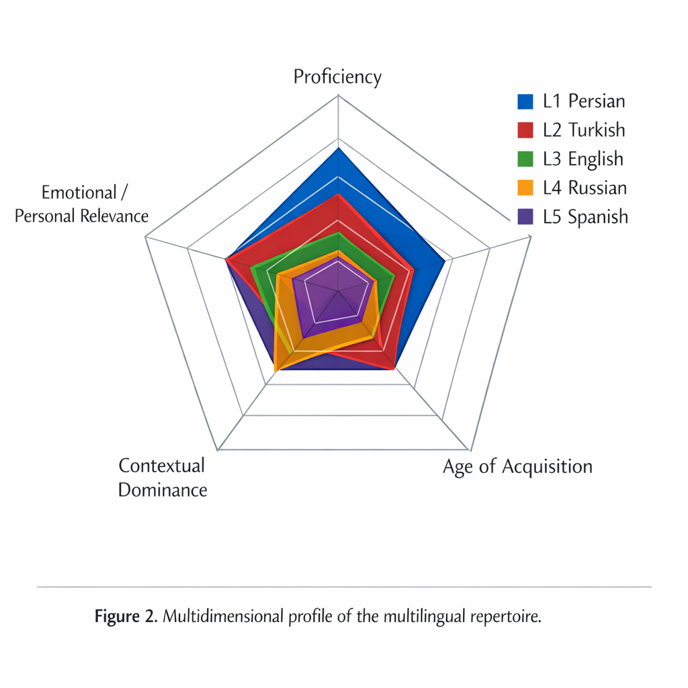
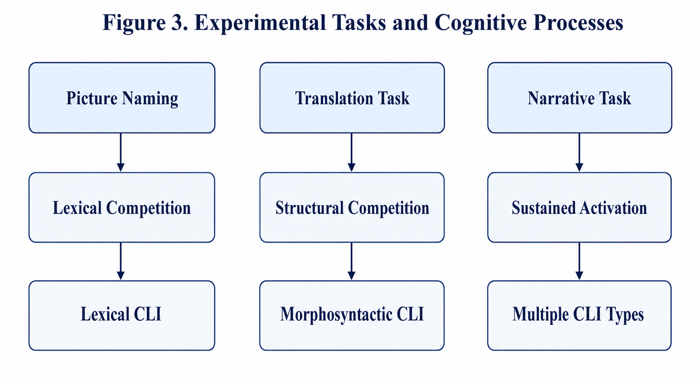
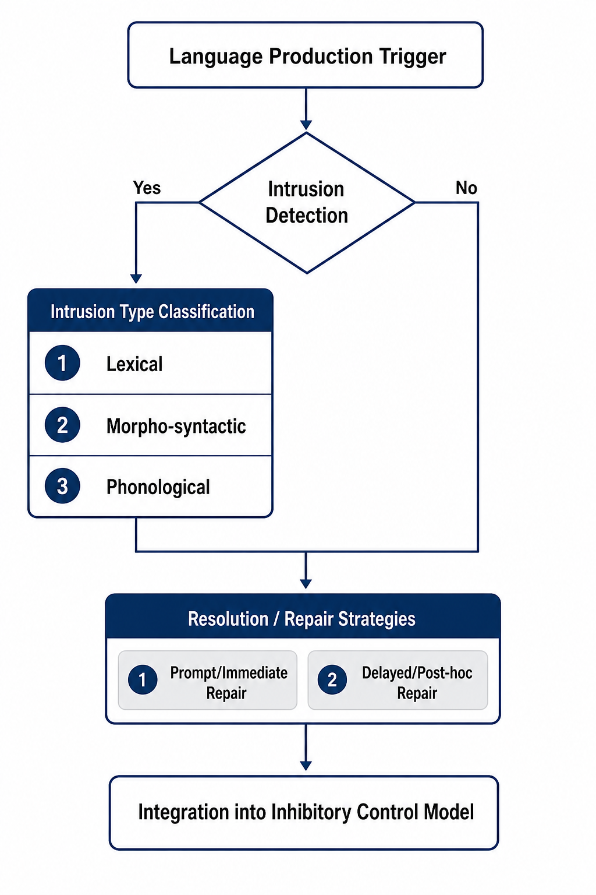
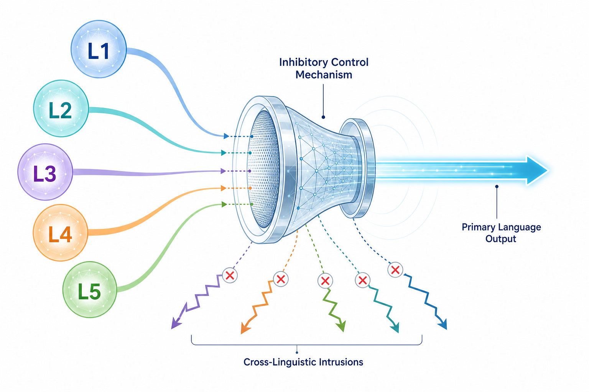

# MIGM: Multilingual Inhibition in L5 Acquisition

## The Paradox of Inhibitory Control in Higher-Order Multilingualism

This repository presents an exploratory self-case study of multilingual inhibitory control in higher-order multilingualism, focusing on Spanish as L5 production in a five-language repertoire.

---

## Figures

### Figure 1. Hierarchical inhibitory control model

### Figure 2. Multidimensional language repertoire profile

### Figure 3. Cognitive task-intrusion relationship

### Figure 4. Cross-linguistic intrusion coding framework

### Figure 5. Latency and inhibitory efficiency model

### Figure 6. Dynamic adaptation in multilingual inhibitory control
.png)

### Figure 7. Statistical distribution of intrusions across linguistic domains
.png)

---

## Overview

This repository documents an exploratory single-case study on multilingual inhibitory control in fifth-language (L5) acquisition. The project investigates cross-linguistic intrusion during Spanish production in a highly multilingual speaker with a five-language repertoire:

- Azerbaijani (L1)
- Persian (L2)
- English (L3)
- Russian (L4)
- Spanish (L5 target language)

The study addresses a central paradox in multilingualism research: higher proficiency does not always predict greater inhibitory interference. Instead, intrusion patterns appear to emerge from a broader interaction of proficiency, age of acquisition, recency, communicative use, dominance, typological proximity, and long-term functional entrenchment.

The repository also introduces the **Inhibitory Gradient Framework (IGF)** as a conceptual model for explaining why some previously acquired languages become more intrusive than others during L5 production.

---

## Key Findings

A total of **51 cross-linguistic intrusion events** were identified across three elicitation tasks.

### Source-language distribution
- **Russian (L4): 43**
- **Persian (L2): 5**
- **English (L3): 3**
- **Azerbaijani (L1): 0**

### Task distribution
- **Picture Naming:** 16
- **Sentence Translation:** 19
- **Narrative Production:** 16

### Intrusion-type distribution
- **Lexical:** 37
- **Morphosyntactic:** 9
- **Phonological:** 5

The most striking finding is the overwhelming dominance of **Russian (L4)** as the source of intrusion, despite **English (L3)** being the stronger and more frequently used non-native language. This supports the argument that inhibitory vulnerability cannot be reduced to proficiency alone.

---

## Study Design

This project uses an **exploratory self-case / single-case design**. The researcher and participant are the same individual. The aim is not statistical generalization, but theoretically informed description and conceptual model building.

### Participant Profile
- **Age:** 40
- **Academic Background:** PhD in TESOL and Applied Linguistics
- **Experience:** More than two decades of language learning, teaching, translation, and applied linguistics research

### Language Profile
- **Azerbaijani:** L1
- **Persian:** L2
- **English:** L3
- **Russian:** L4
- **Spanish:** L5 target language

---

## Research Tasks

Three elicitation tasks were used to generate Spanish production data.

### 1. Picture Naming
Participants named 50 colored pictures representing high-frequency concrete nouns in Spanish.

### 2. Sentence Translation
A set of 20 sentences was translated into Spanish from Persian and English.

### 3. Narrative Production
A six-frame visual story sequence was used to elicit connected oral production in Spanish.

These tasks were selected to create variation in lexical retrieval demands, syntactic planning, and discourse-level control.

---

## Coding and Analysis

Cross-linguistic intrusion was defined as the production of a lexical, grammatical, or phonological element from a previously acquired language when a Spanish equivalent was intended.

### Coding Categories
- **Lexical intrusions**
- **Morphosyntactic intrusions**
- **Phonological intrusions**

### Analytical Approach
- Descriptive frequency counts
- Percentage distributions
- Cross-task comparison
- Qualitative interpretation of representative examples

No inferential statistics were used, as the project is based on a single-case descriptive dataset.

---

## Theoretical Contribution

### Functional Entrenchment

**Functional Entrenchment** refers to the extent to which a language becomes deeply automatized through long-term communicative use across multiple real-life domains. In this study, the concept is used to explain why a language may become highly activation-prone even if it is not the speaker's strongest language in formal proficiency terms.

### Inhibitory Gradient Framework (IGF)

The **Inhibitory Gradient Framework (IGF)** is proposed as a conceptual account of multilingual inhibitory control. It argues that multilingual interference is not governed by a simple hierarchy of proficiency or dominance. Instead, inhibitory difficulty appears to emerge from the interaction of multiple experiential and structural factors, including:

- proficiency
- age of acquisition
- recency of use
- communicative intensity
- domain-specific automatization
- typological overlap
- functional entrenchment

> Note: IGF is presented here as a conceptual and hypothesis-generating framework, not as a validated cognitive model.

---

## Repository Contents

- `Figures/` — all visual figures, conceptual diagrams, and summary graphics used in the manuscript and README
- `Multilingual_Inhibitory_Control_Dataset.csv` — structured dataset and summary tables of intrusion patterns
- `Coding_Manual_CLIs.md` — coding manual for lexical, morphosyntactic, and phonological intrusions
- manuscript files — article drafts and supporting research materials

---

## Data Notes

- This is a **single-case exploratory dataset**
- Findings are **descriptive**, not population-level estimates
- Pause and repair observations are qualitative and should not be interpreted as instrument-based reaction-time measurements
- The dataset may contain multiple summary structures rather than one normalized experimental table
- The findings are intended for **theory development and analytical interpretation**, not broad statistical generalization

---

## Citation

If you use this repository, please cite the associated manuscript and materials appropriately.

**Suggested citation format:**

*The Paradox of Inhibitory Control in Higher-Order Multilingualism: A Self-Case Study of L5 Spanish Production and the Inhibitory Gradient Framework (IGF).*

---

## License

Add the appropriate license information here once selected.

---

## Contact

For questions about the repository, coding framework, or theoretical model, please use the GitHub repository issue tracker or add the preferred contact information here.  Pegah.merrikhiii@gmail.com 
deniz.qizi@gmail.com
+905369574614 whatsapp
